# 💫 Hi! I'm Jtachan

... but you can call me Jaime.

I'm an Algorithm Engineer always with the passion to learn new technologies.
No matter what is the challenge, I bet it can be done!

    
    

You can learn more at my [personal website](https://jtachan.github.io/website/), where you will find descriptions about my projects (finished and ongoing).

## 🌐 Contact

